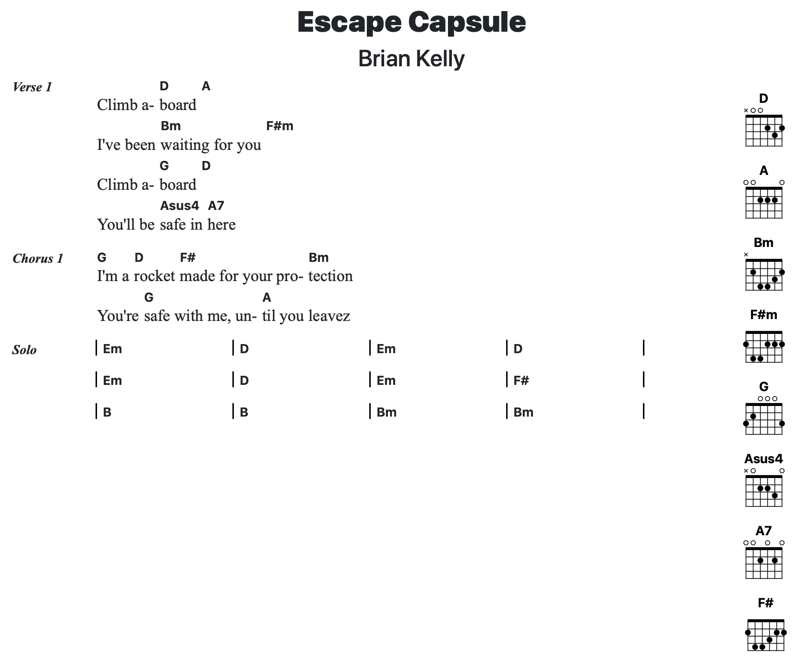

# About

SongPro is a text file format for making chord & lyric lead sheets for songs. It is inspired by ChordPro and Markdown.

## An Example

Here's a partial example of a song in the SongPro format:

```
@title=Escape Capsule
@artist=Brian Kelly

# Verse 1

Climb a-[D]board [A]
I've been [Bm]waiting for you [F#m]
Climb a-[G]board [D]
You'll be [Asus4]safe in [A7]here

# Chorus 1

[G] I'm a [D]rocket [F#]made for your pro-[Bm]tection
You're [G]safe with me, un-[A]til you leave
```

When converted into HTML it looks like this:



## The Format

### Song Attributes

Song attributes are added with the format:

```
@attribute=value
```

 You can specify the following song attributes:

- title
- artist
- capo
- key
- tempo
- year
- album
- tuning

### Sections

Song sections are declared with the format:

```
# Section Name
```

Section names are usually things like:

- Verse 1
- Chorus 2
- Bridge
- Outro

You can name them however you please.

### Lyrics & Chords

Chords are anything contains inside of brackets, such as `C#m7` and lyrics are words by themselves or around chords.

```
You'll be [Asus4]safe in [A7]here
```

### Tablature

Any line starting with `|` is considered to be tablature. For example:

```
|-8--10--12--10--8-|
```

## Tools

- [Web Editor](/editor) - an online editor for quick previewing of songs
- [SongPro Ruby Gem](https://github.com/spilth/song_pro)
